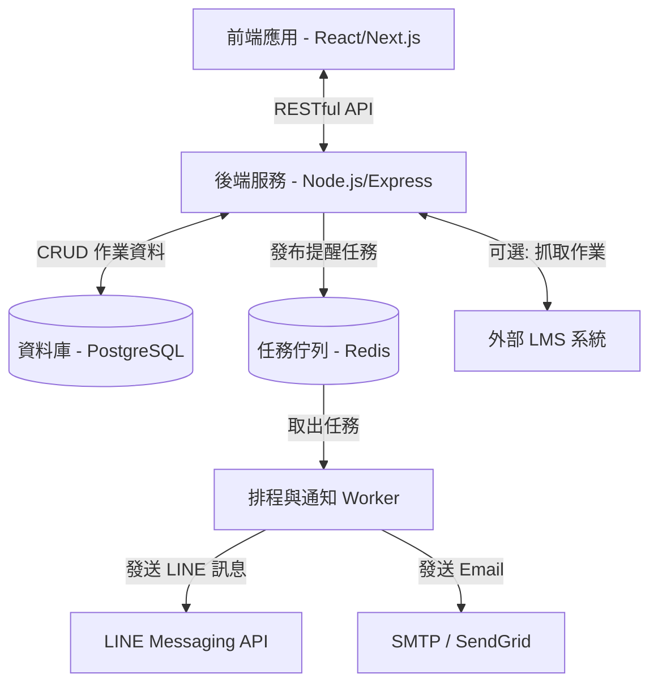

# 作業提醒管理系統 - 系統架構文件 (System Architecture)

## 1. 系統架構概述 (System Overview)
本系統採前後端分離架構設計，以確保系統的可擴展性與維護性。前端負責提供響應式的使用者介面，後端處理核心業務邏輯、API 請求，並結合排程服務負責執行定時的提醒通知。

## 2. 系統架構圖 (Architecture Diagram)

## 3. 核心模組設計 (Core Modules)

### 3.1 前端模組 (Frontend Modules)
- **使用者介面模組 (UI Module)**：提供任務列表展示、新增與編輯任務的表單、行事曆檢視等元件。
- **狀態管理模組 (State Management)**：管理使用者的登入狀態、當前作業列表狀態（未完成/已完成切換）。
- **API 客戶端 (API Client)**：負責與後端進行資料通訊，處理 Request 與 Response 攔截。

### 3.2 後端服務模組 (Backend Services)
- **API 路由層 (API Gateway/Router)**：接收前端請求並進行身份驗證 (Authentication) 與權限控管 (Authorization)。
- **任務管理服務 (Task Service)**：負責作業與報告的 CRUD 邏輯。當任務標記為「已完成」時，觸發取消未執行提醒的邏輯。
- **提醒排程服務 (Scheduler Service)**：根據使用者的設定（例如：提前一天），計算出應發送通知的時間，並將任務推入任務佇列。

### 3.3 通知引擎 (Notification Engine)
- **任務佇列 (Message Queue)**：使用 Redis 配合 BullMQ 或類似工具儲存即將到期的提醒任務，確保高併發下通知不遺漏。
- **Worker 節點**：在背景監聽佇列，時間到即取出任務並呼叫外部 API (LINE, Gmail) 發送。發送前會再次檢查資料庫中該任務的最新狀態，若已完成則放棄發送。

## 4. 技術選型建議 (Tech Stack Recommendations)
- **前端 (Frontend)**: Next.js (React) + Tailwind CSS (適合快速建立現代化響應式網頁)
- **後端 (Backend)**: Node.js + Express.js 或 NestJS (具備良好的排程生態系)
- **資料庫 (Database)**: PostgreSQL (關聯式資料庫適合儲存結構化任務資料) + Prisma ORM
- **快取與佇列 (Cache & Queue)**: Redis + BullMQ (穩定處理大量定時推播任務)
- **部署架構 (Deployment)**:
  - 前端：Vercel 或 Cloudflare Pages
  - 後端：Render, Fly.io 或 AWS (EC2/ECS)
  - 資料庫：Supabase 或 Neon (Serverless Postgres)

## 5. 資料流與時序 (Data Flow Sequence)
1. **設定提醒**：使用者於前端新增作業並設定「提前 1 天提醒」，前端呼叫 API 儲存至資料庫。
2. **建立排程**：後端寫入資料庫後，同步計算通知時間，並推入 Redis 佇列。
3. **完成任務**：若使用者提早完成作業並勾選完成，後端更新資料庫狀態。
4. **觸發通知**：通知時間到達，Worker 準備發送。發送前檢查資料庫，發現任務已完成，則攔截並取消發送。若未完成，則呼叫 LINE/Email API 送出。
