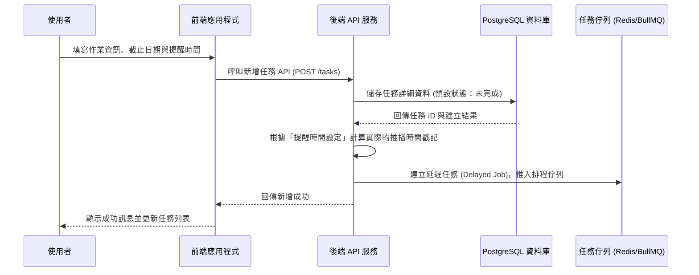
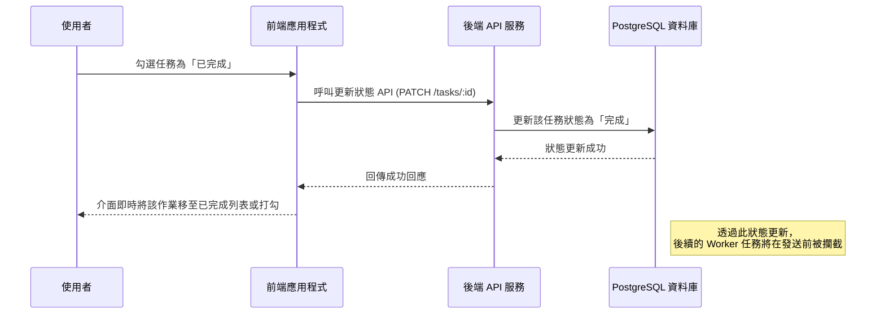

# 作業提醒管理系統 - 流程圖 (Flowcharts)

基於系統需求 (PRD) 與架構設計 (ARCHITECTURE)，以下定義了系統核心的運作流程，包含使用者操作以及背景任務處理的邏輯。

## 1. 使用者新增任務與設定提醒流程 (Sequence Diagram)

此流程展示了使用者在前端建立作業並設定提醒時，系統如何將資料儲存並推入背景排程中。



## 2. 定時任務發送與狀態檢查邏輯 (Flowchart)

此流程說明當背景 Worker 取出準備執行的提醒任務時，如何實作「即時同步繳交狀態」以確保不重複打擾已完成作業的學生。

```mermaid
flowchart TD
    Start([Worker 監聽排程佇列]) --> PopTask{時間到達<br>取出提醒任務}
    PopTask --> QueryDB[依據任務 ID 查詢資料庫最新狀態]
    QueryDB --> CheckStatus{作業是否標記為「已完成」？}
    
    CheckStatus -- 是 (已完成) --> Cancel[攔截：取消發送並丟棄此任務]
    CheckStatus -- 否 (未完成) --> CallAPI[呼叫外部通訊 API<br>(LINE / Email)]
    
    CallAPI --> UpdateStatus[更新資料庫中此筆提醒的狀態為「已發送」]
    Cancel --> End([結束執行])
    UpdateStatus --> End
```

## 3. 使用者更新任務狀態為「已完成」(Sequence Diagram)

展示使用者完成作業後，前端與後端的資料同步流程。


